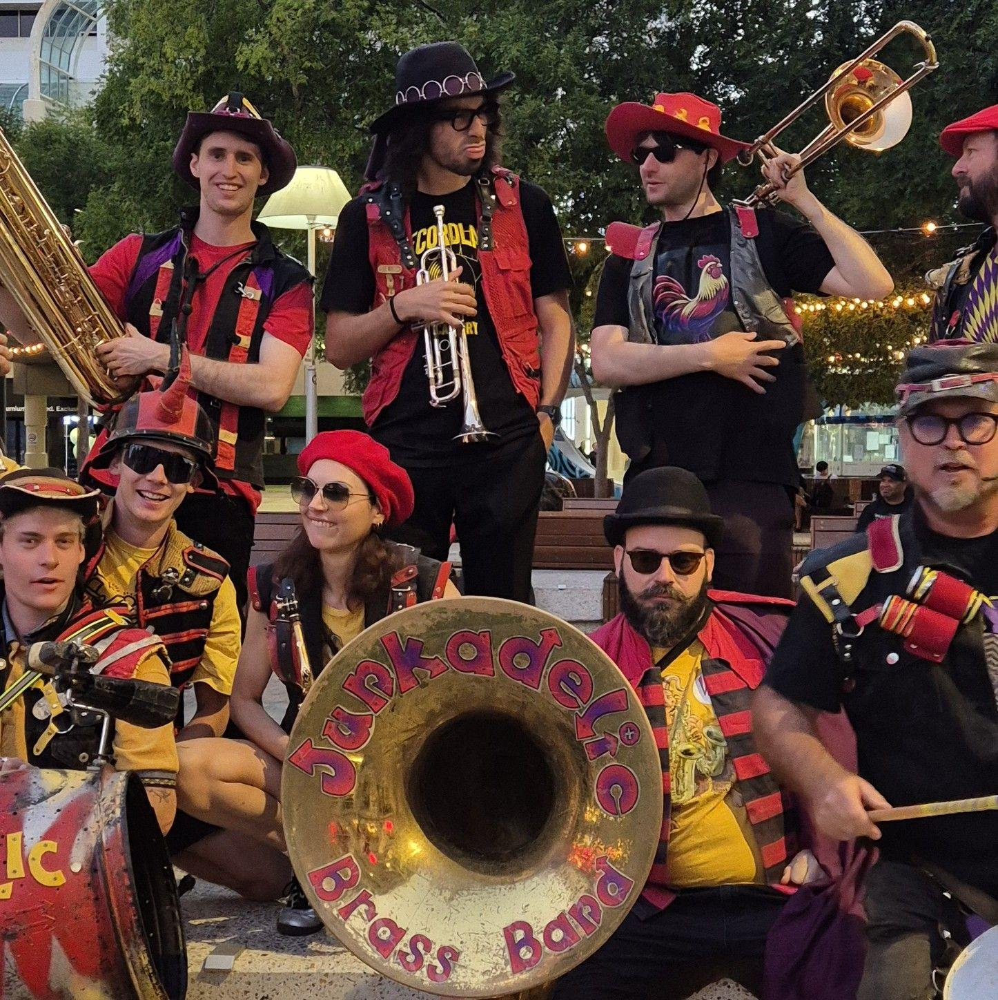
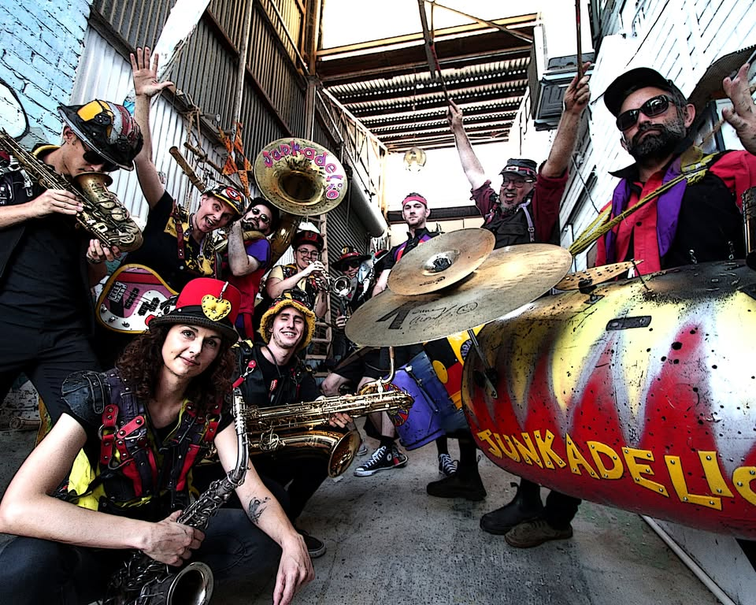

**The Junkadelic Brass Band is a band like no other.**

Hailing from Perth, Western Australia, Junkadelic Brass Band combines a smoking hot brass section, deep-rooted soul vocals, and a funk loaded percussion section using recycled DIY instruments to bring you a unique musical concoction like no other - guaranteed to bring the party! They have performed at major festivals across Australia, including WA's Fairbridge Festival, Perth International Arts Festival, The Kimberley Moon Festival, Honk!Oz, and Southbound, and internationally in Seattle, Portland, San Francisco and Hong Kong.

The Junkadelic Brass band draws on strong influences from New Orleans street music and big bands such as the Dirty Dozen and Rebirth Brass Bands. The band combines traditional "secondline" grooves with horn parts reminiscent of James Brown and Sly and the Family Stone. This emphasis on original big band performance combined with a long history in community engagement, workshops and collaborations has taken the band all over Australia.

In 2015 Junkadelic Brass Band was invited as an artist in residence at the inaugural Honk!Oz Festival in Wollongong, NSW, which led to an invitation to perform at Seattle's beloved Honk!West Festival later that year, undertaking a post-festival tour through Washington, Oregon and California. Other notable performances include Honk!Oz Festival (NSW)(2015-19), Voodoo You Think You Are? at Perth's Fringe Festival (2016-17) and Nova 93.7 Music and Musicals Award nomination (2016), tours to Brisbane in 2017-18 including Redfest (Redlands Strawberry Festival, QLD), and the Port Fairy Folk Festival (VIC)(2019), Fairbridge Festival (2011, 2013, 2016-18) and Nannup Music Festival (2014).

